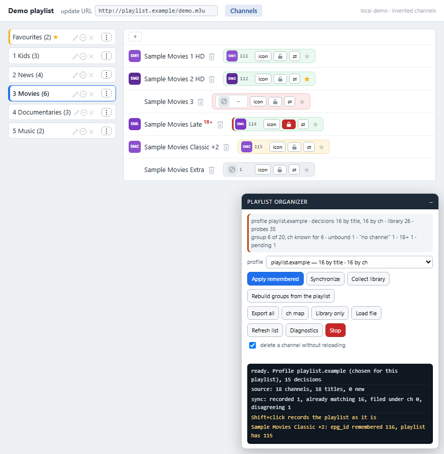
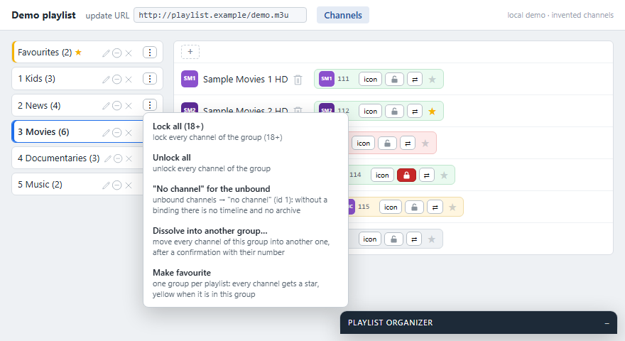
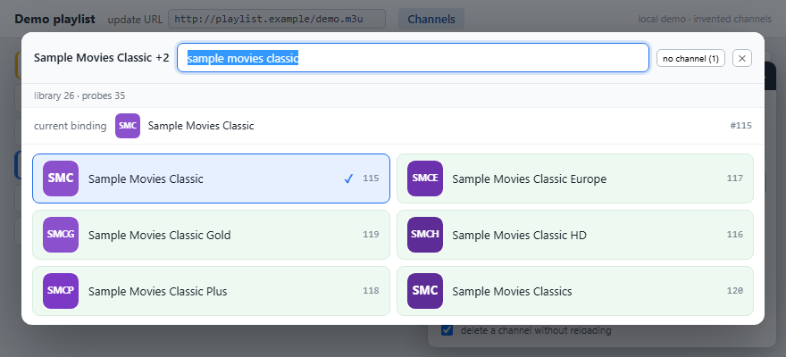
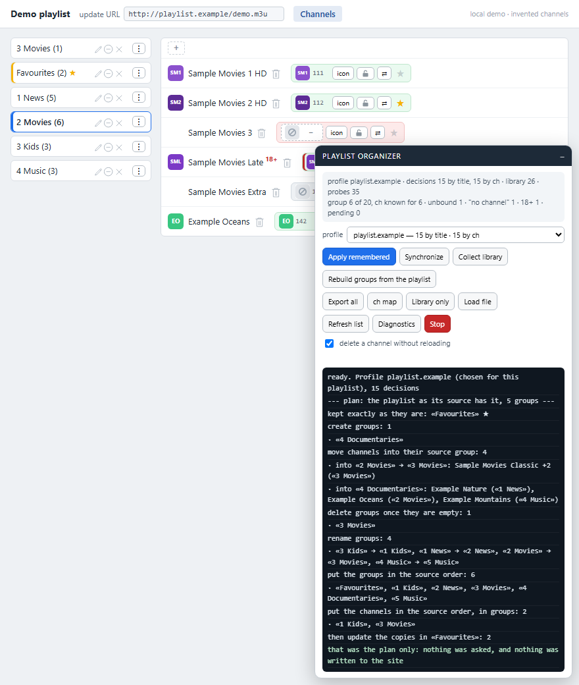

OttPlayer TV Playlist Organizer
===============================
A Tampermonkey userscript that organizes an [OttPlayer](https://ottplayer.tv) playlist right on its edit page: library
icons and EPG, 18+ locks, group moves, and a memory of every decision, so that the next playlist of the same provider
takes one click. This page describes version 1.2.

*The screenshots were taken on a local mock of the edit page, with invented channels.*

## What it is for

OttPlayer gives each channel its icon and programme guide (EPG) by matching the channel's name against its own channel
library. A name it does not recognise leaves the channel without either. An update from the playlist's source brings a
channel that was renamed there back as a new channel, without its 18+ lock. And the site's own editor works on one
channel at a time. The organizer adds what is missing to the edit page itself:

- **Icons and EPG.** Each channel gets a picker that searches OttPlayer's library word by word, where Latin and Cyrillic
  spellings find each other. The entry you choose sets the icon and the EPG at once. A channel with no entry gets
  "no channel" in one click: a channel without any binding has no timeline in the player, so its archive cannot be
  rewound.
- **18+ locks** for one channel or a whole group. Groups whose title contains "For Adults" or «Для взрослых» are locked
  automatically.
- **Moving channels** to another group, one by one or a whole group at once.
- **A memory of every decision**, kept in your browser per provider profile. It files each decision under the channel's
  title and, once it knows it, under the channel code of its stream address (a path part such as `…/ch123/…`). The code
  survives a rename and tells apart channels of the same name. On the next playlist of the same provider,
  **Apply remembered** replays everything in one go.
- **Import and export** of that memory as JSON files, to move it to another browser or keep it in a repository.
- **Rebuilding the groups** with the titles and in the order of the playlist's source. This is for a source that numbers
  its groups ("3. Movies") and renumbers all of them when it reorders them.
- **Favourite copies.** One group per playlist can be the favourite. A star on every channel puts a copy of it into that
  group, with its icon, EPG and lock, or takes the copy out again.

The organizer speaks English or Russian, following the site's language setting, else the browser's.

## How to Install

1. Install Tampermonkey from its official site, <https://www.tampermonkey.net/>, or from your browser's store:
   [Chrome](https://chromewebstore.google.com/detail/dhdgffkkebhmkfjojejmpbldmpobfkfo),
   [Microsoft Edge](https://microsoftedge.microsoft.com/addons/detail/iikmkjmpaadaobahmlepeloendndfphd),
   [Firefox](https://addons.mozilla.org/en-US/firefox/addon/tampermonkey/),
   [Safari](https://apps.apple.com/app/tampermonkey/id6738342400),
   [Opera](https://addons.opera.com/en/extensions/details/tampermonkey-beta/).
2. In Chrome, Edge and other Chromium browsers, allow Tampermonkey to run userscripts. Tampermonkey 5.3 and later needs
   one of these two switches ([Tampermonkey FAQ, Q209](https://www.tampermonkey.net/faq.php?q=Q209)):
   - Chrome 138 and later: right-click the Tampermonkey icon, choose **Manage Extension** and switch on
     **Allow User Scripts**.
   - Older Chrome, and Edge: open `chrome://extensions` (in Edge `edge://extensions`) and switch on **Developer mode**
     at the top right.
3. Open the script's link:
   <https://raw.githubusercontent.com/HenkerX64/tampermonkey-web-helpers/main/ottplayer/ottplayerTvPlaylistOrganizer.user.js>.
   Tampermonkey shows its installation page for the script. Click **Install**.

Updates arrive by themselves: Tampermonkey checks the same link and installs a version with a higher number.

## First run

1. Log in at ottplayer.tv and open the edit page of a playlist, `https://ottplayer.tv/playlist/edit/<number>`, on its
   Channels tab. The **Playlist organizer** panel appears in the bottom right corner, the channels of the open group get
   their controls, and every group tab gets a ⋮ menu. The first line of the log says which profile is in use, and why.
2. The first time the organizer reads the playlist's source, the file behind the playlist's update URL, Tampermonkey
   asks whether the script may connect to that host. **Synchronize** and **Rebuild groups from the playlist** do this;
   the status line then says "loading the source… Tampermonkey may ask to allow the domain". Allow the connection. The
   script declares `@connect *`, because every playlist has its own source host, so Tampermonkey's dialog also offers
   **Always allow all domains**. The organizer only downloads the playlist file from there.
3. Check the **profile** field before you apply anything (see [Profiles](#profiles)).

On a playlist you have already tidied by hand, a good start is **Synchronize**, which records what the playlist shows,
followed by **Collect library**.

## The panel

Each entry below says what it does to the playlist on ottplayer.tv:

- *writes*: changes the playlist;
- *reads only*: reads the site or the playlist's source and changes nothing there;
- *browser only*: touches neither. It works on the organizer's memory or on a file on your computer.

Whatever the organizer learns goes into its memory in every case (see [Where the data lives](#where-the-data-lives)).

**The title bar** reads "Playlist organizer". Its **–** button (hint "collapse") folds the panel down to the title bar and
opens it again.

**The two lines at the top** count what the organizer knows. The first shows the profile, its decisions by title and by
channel code ("ch"), the size of the collected library and the number of library searches made ("probes"). The second
covers the open group: its channels, how many have a known channel code, how many are unbound, on "no channel",
locked (18+), and pending. A pending channel is one whose remembered decision differs from what the page shows. An orange
mark on the left means that something in the open group is pending.

**profile**: which set of remembered decisions this playlist uses. Each entry shows how many decisions it holds by
title and by channel code. A choice is kept for this playlist. *Browser only.*

The buttons, in the order of the panel:

- **Apply remembered**: *writes, after a question.* Replays the current profile's decisions on the whole playlist:
  the library binding (icon and EPG), the 18+ lock, and the group, when this playlist has a group of the remembered
  title. First it reads the forms of channels that share a title and whose channel code it does not know yet, to tell
  them apart. The question names how many channels will change, and how many of them only move to another group. A
  channel is never taken out of the favourite group, and never moved into it when that group already holds its copy.
  When there is nothing to change, the log says "everything is as remembered…". When the profile knows none of the
  playlist's titles, the log says so and names the profiles that hold decisions.
  **Shift+click:** the open group only, and without asking.
- **Synchronize**: *reads only.* Downloads the playlist's source and learns which title belongs to which channel code.
  Then it records what the playlist already shows as decisions: bindings made by OttPlayer's own matching, by hand or
  by other tools, and 18+ locks. It only fills gaps. Where the playlist disagrees with a remembered decision, the log names
  the difference and the memory stays as it is. When the source cannot be loaded, it works with the channel codes of
  the forms it has read before.
  **Shift+click:** the playlist wins. Its current state replaces the remembered decisions where they differ.
- **Collect library**: *reads only.* Searches OttPlayer's library for the first two letters of every word in the
  playlist's channel names, in Latin and in Cyrillic letters, and keeps the answers. The picker then finds entries
  without waiting, and no search is ever made twice.
  **Shift+click:** searches every pair of letters and digits, which sweeps the whole library. That is thousands of
  searches and takes a long time. **Stop** ends it.
- **Rebuild groups from the playlist**: *writes, after a question.* Brings the groups back in line with the playlist's
  source (see [Rebuilding the groups](#rebuilding-the-groups)). The whole plan goes to the log first, and nothing is
  changed before you confirm it.
  **Shift+click:** shows the plan only. It asks nothing and writes nothing to the playlist.
- **Export all**: *browser only.* Saves the organizer's memory as `ottplayer-mapping-<profile>.json`: the library, the
  searches made, and the decisions of every profile.
- **ch map**: *browser only.* Saves the current profile's decisions by channel code, sorted by number, as
  `ottplayer-ch-<profile>.json`. It is a compact table of channel code → library id (`epg_id`), handy to keep in a
  repository.
- **Library only**: *browser only.* Saves the collected library and the list of searches made as
  `ottplayer-library.json`. The library is the same for every provider.
- **Load file**: *browser only.* Merges one of these exported `.json` files into the memory (see
  [Where the data lives](#where-the-data-lives)). It also takes the playlist itself as an `.m3u` or `.m3u8` file and learns
  its title → channel code pairs, as Synchronize does from the source. Use that when the source cannot be downloaded.
- **Refresh list**: *reads, then may write.* Loads the channel lists from the site again, without reloading the page.
  Afterwards it locks the groups for adults, as a page opening does (see [Safety](#safety)).
- **Diagnostics**: *reads only.* Puts a report into the log: the counts, the profile and why it was chosen, how many
  channels have a known channel code, the first channel with its edit address and form fields, a test search of the
  library, and the page's own code for deleting and hiding groups. In the form fields, only values after `token=` are
  masked.
- **Stop**: ends the running work after the channel or search in progress. Whatever you start after Stop runs as usual.
  Nothing already saved is undone.

**delete a channel without reloading** (on by default): *writes, after a question.* A click on a channel's own trash
link asks "Delete channel «…»?" and deletes the channel without reloading the page. Switched off, the page's own dialog
handles the trash link. Rows the organizer inserted itself, such as new favourite copies, are always deleted by the
organizer, because the page's dialog does not know them.

**The status line** under the checkbox shows the work in progress, such as "applying 3/12". **The log** below keeps the
last 300 lines: green for done, yellow for warnings, red for errors.

### Channel rows

Only the channels of the open group carry controls, and opening another group adds them there. Every change made with
these controls is also remembered for the profile, except the star's: a copy is not a decision. The colour of a row's
controls tells its state:

- green: bound to a library entry;
- red: unbound;
- grey: "no channel";
- amber: pending, so Apply remembered would change it;
- a red edge on the left: locked (18+).

A faded icon means the library has no picture for that entry.

From left to right:

- **The binding**: the library icon and its number. An unbound channel shows a dashed button instead (hint
  `set "no channel"`). One click binds the channel to "no channel" (library id 1). *Writes, without a question.* The
  organizer reads the channel's form first, and writes nothing when the channel is on "no channel" already.
- **icon** (hint "choose icon and EPG"): opens the [library picker](#library-picker).
- **The lock** (hint "set 18+" or "remove 18+", red when locked): switches the 18+ lock. *Writes, without a question.*
- **⇄** (hint "move to another group"): turns into a list, "move to…", of the other groups. The group you choose takes the
  channel. *Writes, without a question.* The organizer does not put a second copy of a channel into the favourite group,
  and does not move a copy out of it while its original is in another group.
- **★**, once a group is the favourite. *Writes, without a question.*
  - A grey star puts a copy of the channel into the favourite group, with the channel's icon, EPG and 18+ lock. The
    organizer reads the favourite group from the site first, and never makes a second copy.
  - A yellow star means that the favourite group holds a copy. A click deletes that copy; the channel itself stays where
    it is. A row of the same title that plays another stream is left alone.
  - A star with a dashed outline sits in the favourite group on a channel whose title exists nowhere else. It may be a
    channel that lives there, or a copy whose original was renamed or deleted, so the star does nothing.
  - A faded star means that several channels share the title, so the star cannot tell which copy is whose.

### Group menu

Every group tab has a **⋮** button (hint "group actions"). Lock all, Unlock all, "No channel" and Dissolve open the group
first, so that you can watch them work.

- **Lock all (18+)**: *writes, after a question.* Locks every channel of the group. Channels that are locked already are
  not written.
- **Unlock all**: *writes, after a question.* Unlocks every channel of the group. The organizer remembers them as
  unlocked, so the automatic lock of groups for adults leaves them alone.
- **"No channel" for the unbound**: *writes, after a question with the number.* Sets "no channel" for every channel of
  the group that has neither a binding nor a remembered one.
- **Dissolve into another group…**: *writes, from its own dialog.* The dialog, "Dissolve «…»", asks for the target in
  "move its channels to". It then says how many channels will move from where to where, and **Move N channels** starts.
  While it runs, a progress bar shows, and **Cancel** turns into **Stop**. The emptied group stays; delete it with the
  page's own control if you like. The favourite group has no Dissolve.
- **Make favourite**: *browser only.* Makes this group the playlist's favourite. It is highlighted, and every channel row
  gets a star. When another group was the favourite and holds copies, the organizer asks first, because those copies then
  turn into ordinary channels.

The favourite group's menu has the first three items, then:

- **Update the copies**: *writes, after a question with the number.* Gives every copy in the group its original's current
  stream address, binding and 18+ lock. An update from the source gives the original a new address but never the copy,
  so without this a copy can stop playing. The log names the rows without exactly one original elsewhere and leaves them
  as they are. Nothing is deleted.
- **No longer favourite**: *browser only.* The stars disappear, and no channel changes. When the group holds copies,
  the organizer asks first: afterwards Apply remembered may move each copy next to its original, and Update the copies no
  longer reaches them.

### Library picker

- **The search field** (placeholder "search the library…") starts with the channel's title cleaned for searching. HD, SD,
  FHD, UHD, HDR, 4K, TV, "channel" and time shifts such as +2 are dropped. What you type is searched as you type it,
  word by word, and Latin and Cyrillic spellings find each other. Library searches that are still missing are made in the
  background; the line below then says "requesting: …".
- **no channel (1)**: binds the channel to "no channel". *Writes.*
- **✕** (hint "close") closes the picker, as do Esc and a click outside it.
- The line below counts the library and the searches made.
- **current binding** shows the channel's present entry with its picture, name and number, or "not bound". The same
  entry is ticked (✓) among the results.
- **The results**: up to 60, sorted by name. A click on one binds the channel to it, and Enter takes the first. *Writes.*
  When no entry has every word you typed, the picker drops words from the end and says which query it shows. With more
  than 60 hits it asks you to refine the query.

## Rebuilding the groups

Some sources number their groups by position ("1. News"). When such a source reorders its groups, it renumbers all of
them. OttPlayer's update then puts only the new channels into new groups, and every other channel stays in its old group.
So a playlist ends up with "1 News" and "2 News", or with "2 Movies" beside an almost empty "3 Movies".
**Rebuild groups from the playlist** reads the source and the playlist as the site has it now, and plans for each group of
the source:

- Of the groups whose title is the same apart from the number, it keeps the one that already holds most of that source
  group's channels. It renames that group to the title an update would give it now ("3. Movies" becomes "3 Movies", as
  OttPlayer's import writes it). When no group fits, it creates one.
- It moves every channel into its source group, deletes the groups left empty, and puts the groups and their channels in
  the source's order.
- It then updates the copies in the favourite group.

*The log is shown at its full height in this picture. In the panel it scrolls.*

- **Shift+click** shows the plan and stops there: nothing is asked and nothing is written to the playlist. The log ends
  with "that was the plan only: nothing was asked, and nothing was written to the site".
- **A click** plans the same way, then asks with the plan's headings and numbers. **Cancel** writes nothing.
- **Kept exactly as they are:**
  - the favourite group, which goes first;
  - groups you hid with the page's own control;
  - «скрытые» ("hidden"), the group every import creates for channels the player does not show.

  The hidden ones go last. Their channels are never moved, and neither are the channels of a source group that belongs
  to one of them.
- A channel that the source does not know, or cannot place in one group, stays where it is and is listed in the plan.
  A group is deleted only once the site shows it empty.
- The work runs step by step with progress and **Stop**. Groups are created first, then the channels move, then empty
  groups are deleted, and only then are groups renamed and sorted. A run that was stopped, or that failed half-way,
  leaves a state the next run finishes. At the end the organizer plans again on what the site shows. It reports
  "rebuilt as in the source" when nothing is left, or "rebuilt in part" with what the next run will do.
- A channel the rebuild moves forgets any group you once chose for it by hand, so Apply remembered does not move it back.
  Its icon, EPG and lock stay remembered.
- Reload the page afterwards, before you use the page's own drag and drop or group links (see [Safety](#safety)). The
  last log line says so too.
- The rebuild does not lock groups for adults; the next page opening does.

## Workflows

- **A new playlist of a provider you have worked with before:** open its edit page, check the profile, then
  **Apply remembered**.
- **After OttPlayer updated the playlist from its source:** **Synchronize**, so that it learns the new titles. Then
  **Apply remembered**, which brings back locks and bindings by channel code. Last, **Update the copies** in the favourite
  group's menu.
- **After the source reordered its groups:** Shift+click **Rebuild groups from the playlist**, read the plan, then click it
  and confirm. Reload the page afterwards.

## Profiles

A profile is one set of remembered decisions. The organizer picks one when the page opens, in this order:

1. the profile chosen for this playlist;
2. the profile used last;
3. the largest one;
4. a profile named after the host of the playlist's update URL, with leading numbered server labels dropped
   (`10.playlist.example` becomes `playlist.example`);
5. `default`.

The first log line names the choice and its reason. A playlist is tied to a profile when you choose one in the
**profile** field, and when the organizer remembers its first decision there. So a new playlist starts with the profile
you used last.

## Where the data lives

- **In your browser, nowhere else.** The memory is one `localStorage` entry of `https://ottplayer.tv`, named
  `ott-mapper-v1`. Beside it sit `ott-mapper-v1:profile:<playlist id>` (the profile chosen for a playlist) and
  `ott-mapper-v1:profile:last`. Nothing is sent anywhere, and Tampermonkey's own storage is not used.
- **What it holds:**
  - the library entries found so far (number and name) and the searches made;
  - per profile: the decisions by title and by channel code, and which title has which channel code;
  - per playlist: the channel codes read from channel forms, the channels on "no channel", and the favourite group;
  - the setting of the delete checkbox.
- **Per browser.** Another browser, or another browser profile, starts empty. Clearing the site data of ottplayer.tv
  deletes the memory. Two open tabs share it: when one tab saves, the other merges what it saved.
- **Backing up:** **Export all**, and keep the file. It holds everything except the profile chosen per playlist and the
  delete setting.
- **Restoring and merging:** **Load file**. A merge adds and never deletes. Where a record exists on both sides, the
  file's fields win. Library names are added or updated. A favourite group in the file replaces the stored one for that
  playlist. A **ch map** file goes into the profile it names, else into the current one.
- The name `ott-mapper-v1` is kept from the first version, so that an update never loses what you collected.

## Safety

**Changes to the playlist on ottplayer.tv, after a question:**

- **Apply remembered**, except with Shift+click;
- **Lock all (18+)**, **Unlock all**, **"No channel" for the unbound**, **Dissolve into another group…** and
  **Update the copies** in the group menu;
- **Rebuild groups from the playlist**;
- deleting a channel with its trash link, while **delete a channel without reloading** is on.

**Changes without a question:** one channel per click from a result or **no channel (1)** in the picker, the "no channel"
button of an unbound row, the lock, a group chosen from ⇄, and the star; and the whole open group from Shift+click on
**Apply remembered**.

**A change the organizer makes by itself:** when the page opens, and after **Refresh list**, it locks (18+) every channel
of a group whose title contains "For Adults" or «Для взрослых». An update from the source brings a channel that was
renamed there back without its lock. This lock never unlocks anything, leaves alone a channel you unlocked with the
organizer, and remembers nothing.

**Never a change to the playlist:** **Synchronize**, **Collect library**, the three exports, **Load file**,
**Diagnostics**, **Refresh list** apart from that lock, Shift+click on **Rebuild groups from the playlist**, the
**profile** field, **Make favourite** and **No longer favourite**.

**How it writes.** OttPlayer's channel form saves the whole channel at once. So the organizer reads each channel's form,
changes only the fields it means to change, and sends the rest back as it was, stream address included. Its batches
write one channel at a time, through one queue, so two saves of one channel never overlap. The first save of a session
is read back, and the log confirms it with "✓ the first save was read back — saving works", or names the fields the
server did not change.

**Stop** ends every batch after the channel in progress. Nothing is rolled back.

**After Refresh list or a rebuild**, reload the page before you use the page's own drag and drop, or a group's own rename,
hide or delete: the page wires them once, when it loads. Keep **delete a channel without reloading** switched on until
then. Otherwise the page's own delete dialog may still hold a channel that was clicked before.

**No passwords.** The organizer works in your logged-in session. It never asks for, stores or sends a password. Apart
from ottplayer.tv, it contacts only the playlist's source host, and only to download the playlist.

## Troubleshooting

- **No panel.** The address must be `https://ottplayer.tv/playlist/edit/<number>`, and you must be logged in. Check that
  Tampermonkey and the script are switched on, and in Chrome or Edge the switch from install step 2. Then reload the
  page.
- **"no channels visible — open the Channels tab":** open the playlist's Channels tab and a group.
- **"the source did not load (…)":** the playlist needs an update URL, and its host must answer within 60 seconds.
  Tampermonkey must also be allowed to connect to the host. If you refused, the script's settings tab in Tampermonkey has
  a user domain whitelist where the host can be added. Until then, Synchronize works with the channel codes of forms
  already read, and **Load file** takes the playlist's `.m3u`. The rebuild needs the source itself.
- **"the session expired — log in again"** or **"the site redirected the request — check that you are still logged
  in":** log in again in the same browser, then reload the page.
- **"none of the … titles … is in profile «…»":** the profile holds no decision for this playlist. The next log line
  names the profiles that do; choose one in the **profile** field.
- **"group «…» did not open — open it by hand and repeat":** click the group's tab, then choose the menu item again.
- **"⚠ the server accepted the save but did not change …":** the site ignored a field. Press **Stop** and report it.
- **"⚠ the browser storage is full — the latest decisions are not saved":** press **Export all** at once. The file holds
  the decisions that could not be saved.
- **Dragging or a group's own links misbehave after Refresh list or a rebuild:** reload the page.

Problems and ideas go to the [issues](https://github.com/HenkerX64/tampermonkey-web-helpers/issues). The report of
**Diagnostics** helps. Read it before you post it, since only `token=` values are masked in it.
